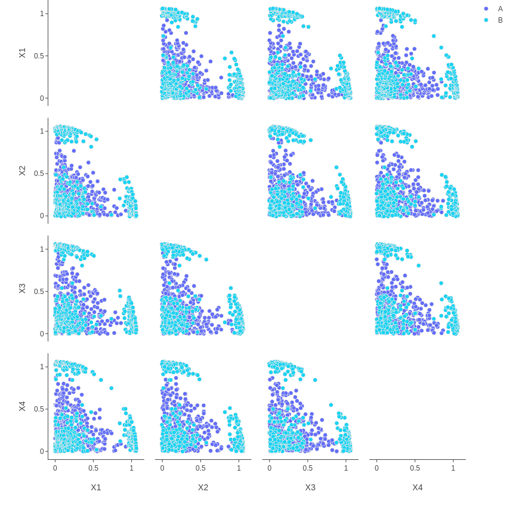
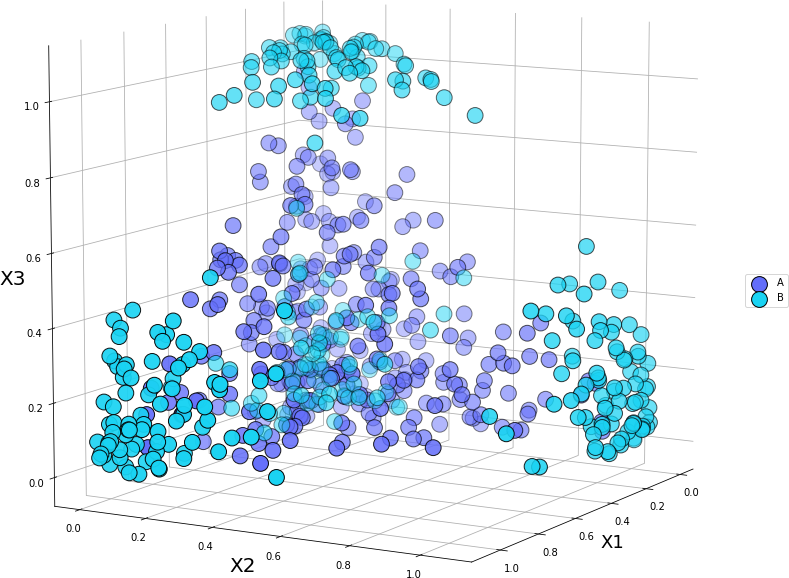
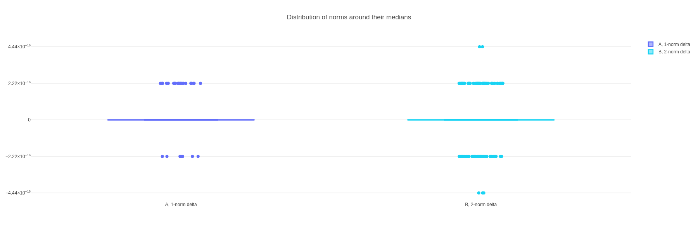
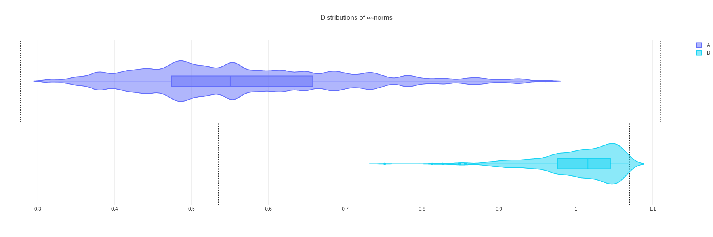
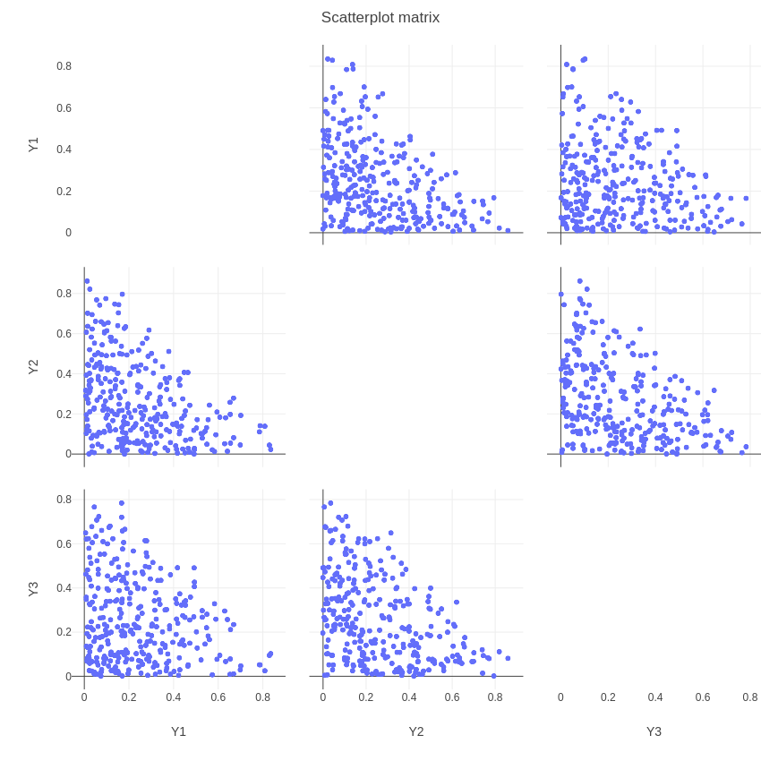
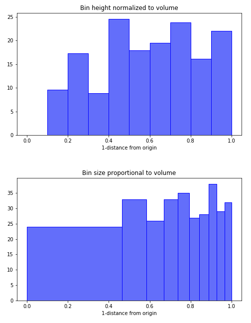
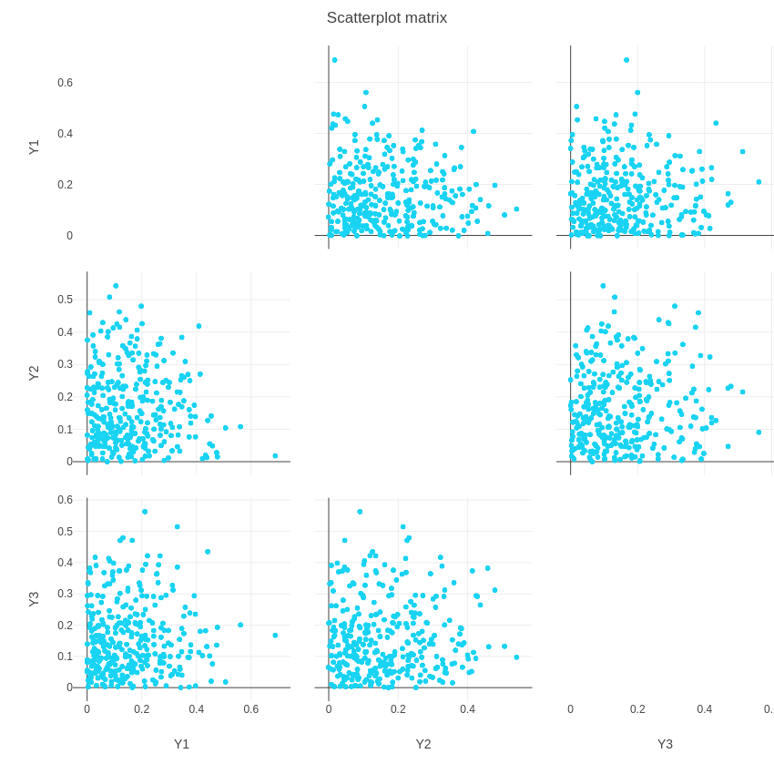

```{r setup, include=FALSE}
knitr::opts_chunk$set(echo = FALSE)
knitr::opts_chunk$set(cache = TRUE)
```


## Provided Dataset

```{r, echo=FALSE, results='hide', message=FALSE, warning=FALSE}
setwd("/home/diego/UNITS/DSSC/DataVisualization/Data_Viz")


library(dplyr)
library(ggplot2)
library(knitr)
library(cowplot)
library(kableExtra)

options(knitr.table.format = "html")
```


The dataset contains:

- 635 observations
- 4 continuos positive variables
- 2 categories (A, B)

<br>

```{r, echo=FALSE, results='hide', message=FALSE, warning=FALSE}
data = read.csv("group1_data.csv")
data$X <- NULL
```


```{r}
data[1:10,] %>% kable(align = "c") %>%
  kable_styling(bootstrap_options = "striped", font_size = 20, full_width = T)
```


## Proportions


<center>
```{r, fig.height=8, fig.width=10}
ggplot(data = data) + geom_bar(mapping = aes(x=Category, fill=Category)) +
  xlab("Category") +
  ylab("Number") +
  labs(title="") + theme_minimal() + 
  scale_fill_manual("legend", values = c("A" = "#636efa", "B" = "#19d3f3"))

```
</center>


## Scatter Matrix

<table align="center" style="margin: 0px auto;"><tr><td valign="top">

</td></tr></table>


## 3D View

<br><br>
<table align="center" style="margin: 0px auto;"><tr><td valign="top">

</td></tr></table>


## Boxplot of 1-norms and 2-norms

<br><br>
<table align="center" style="margin: 0px auto;"><tr><td valign="top">

</td></tr></table>


## Violin plot of infinity norms

<br><br><br>



## Category A: projected points
<!-- A | B -->
<!--  |  -->

<!-- <div class="column" valign="top"> -->
<table align="center" style="margin: 0px auto;"><tr><td valign="top">

</td><td valign="top">
&ensp;&ensp;&ensp;&ensp;&ensp;&ensp;&ensp;&ensp;&ensp;&ensp;&ensp;&ensp;
</td></tr></table>
<!-- </div> -->


## Category B: projected points


<table align="center" style="margin: 0px auto;"><tr><td valign="top">

</td></tr></table>
